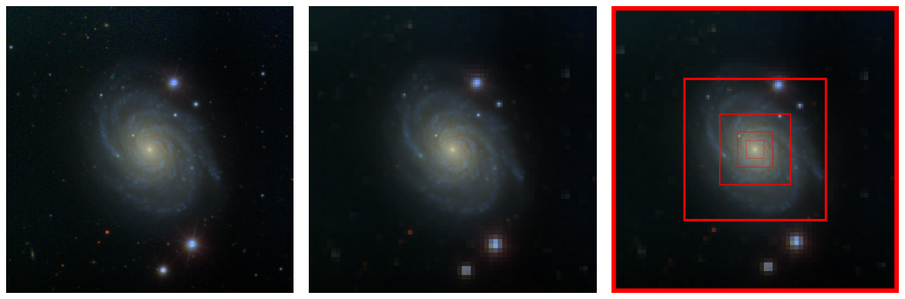

# Photometric Redshift Inference via Multi-resolution imaging Evaluation (PRIME)




## Carpeta `models`
En esta carpeta se encuentran los modelos implementados en Pytorch Lightning, tanto para imágenes de resolucion simple (**`model_pasquet.py`**) como para imagenes en multi-resolución (**`model_prime.py`**).

## Carpeta `train`

En esta carpeta se encuentran archivos Python para entrenar los modelos via terminal. Para tener mayor control de este se utiliza la libreria **argparse**, mediante la cual se podran modificar todos los hiperparametros del entrenamiento. En este caso no se le da una ruta hacia un dataset de test debido a que se aplicó cross-validation. Tambien cabe destacar que se fue entrenando cada fold de forma independiente (una ejecucion de codigo por cada fold).

Adicionalmente se tiene el archivo **`datasets.py`**, el cual procesa y crea los dataloaders para entrenar el modelo. Los dataloaders quedan dentro de un `LightningDataModule`, el cual contendrá los datasets de entrenamiento, validación y test. El dataset de entrenamiento posee Data-augmentation, el cual consiste en rotaciones aleatorias en 0°, 90°, 180° y 270° grados además de Flips horizontales y verticales. Las imágenes no fueron pre-procesadas.

Dicho esto, para poder llevar a cabo el entrenamiento de resolucion simple se debe ejecutar el scripts `train_pasquet_cross_validation.py`:

```python
python train_pasquet_cross_validation.py --train_path datasets\h2f_train_sdss_kfold1.npz --test_path datasets\h2f_val_sdss_kfold1.npz --img_size 64 --epoch 40 --save_files resultados\h2f_sdss\cv\fold1 --seed 0 --num_workers 4 --batch_size 128
```

## Carpeta `test`

Esta carpeta contiene el archivo **`test.ipynb`**, en el cual se muestran los resultados de todos los experimentos. Las funciones utilizadas para graficar los diversos resultados se encuentran en el archivo **`utils_plot.py`** de la misma carpeta.

## Carpeta `download_data`

En esta carpeta se encuentran diferentes archivos Python los cuales fueron usados para descargar todas las imagenes mediante el uso de *threading*, el cual es util para descargar las imagenes en menor tiempo.

- **`h2f_script_threading_panstamps.py`**: Utilizado para descargar imagenes en resolucion simple del survey Pan-STARRS mediante el uso del servidor *panstamps*.
- **`h2f_script_threading_simple_res.py`**: Utilizado para descargar imagenes en resolucion simple del survey SDSS mediante el uso del servicio *HiPS2FITS*.
- **`h2f_script_threading_multiresolution.py`**: Utilizado para descargar imagenes en multi-resolucion del survey SDSS mediante el uso del servicio *HiPS2FITS*.

## Carpeta `others`

En esta carpeta se encuentran experimentos adicionales ademas de cómo fue realizada la particion de datos con stratify cross-validation. Adicionalmente se adjuntan los indices respectivos de cada imagen como diccionarios (**last_kfolds_idxs.npy**).


## REQUIREMENTS:

- `Python 3.10.11`
- `lightning 2.2.4`
- `Pytorch 2.2.1`
- `Version CUDA 12.1` 
